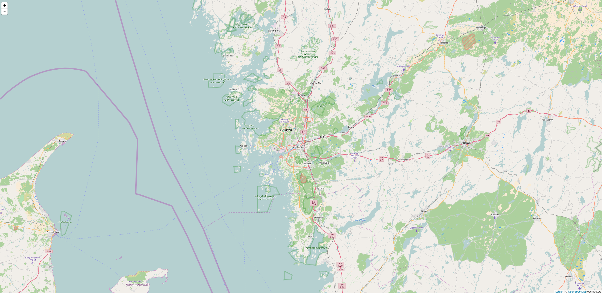
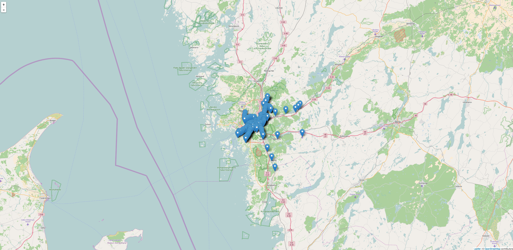
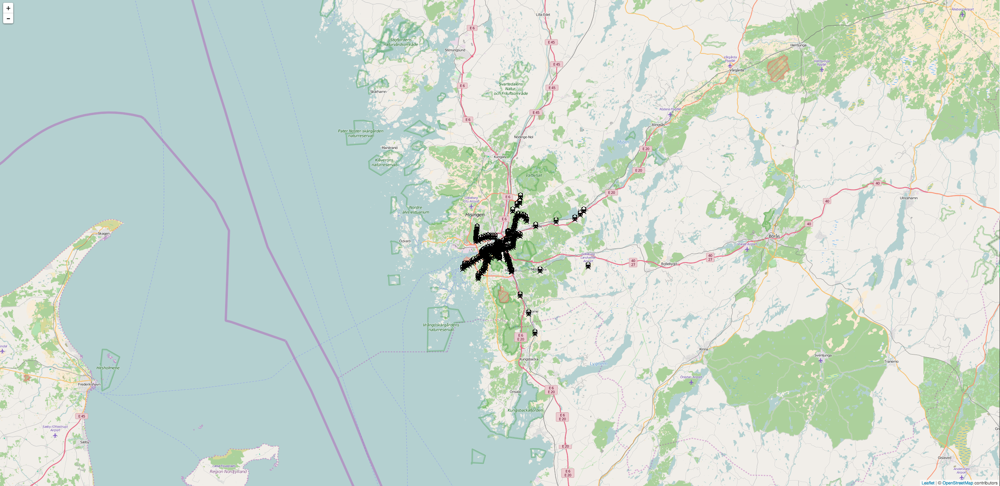
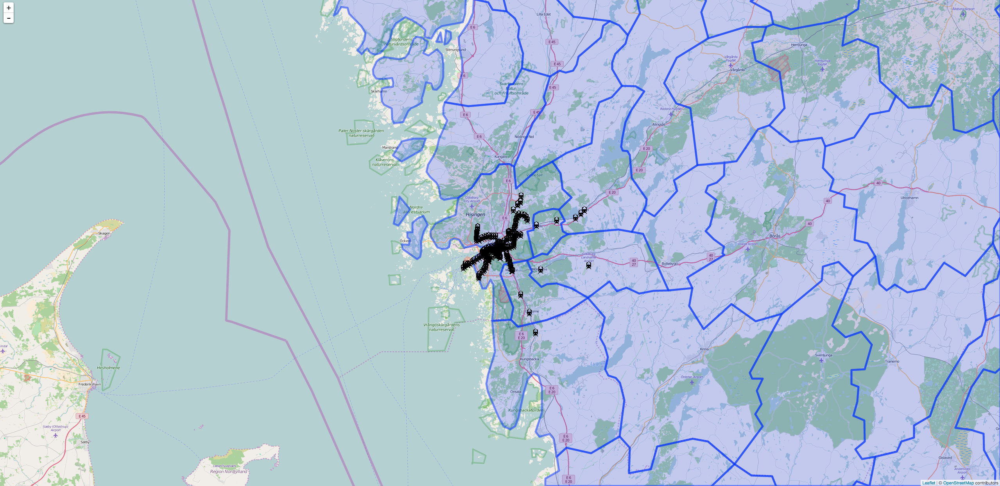
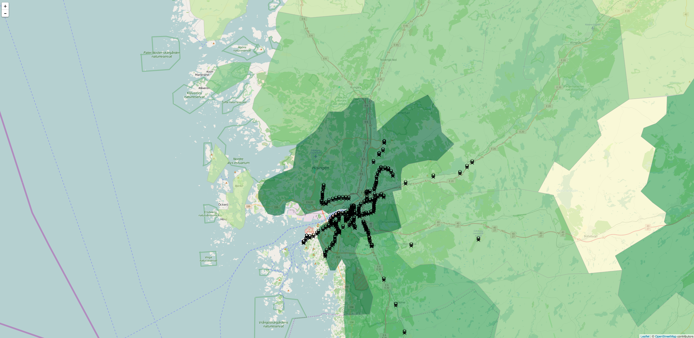
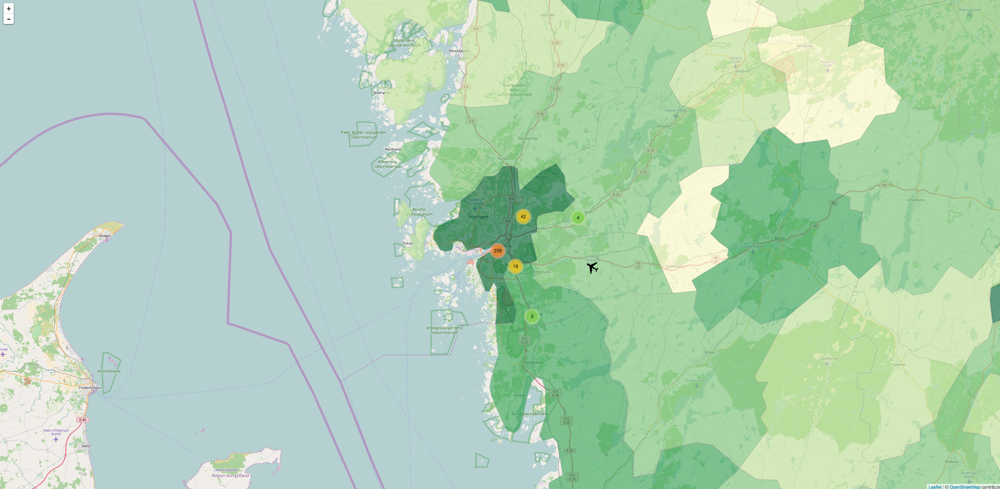

# Leaflet: Make a web map (the Gothenburg edition)!

**This is totally a rip off ot the great introduction to web maps using Leaflet written by Andy Woodruff and Ryan Mullins for Maptime Boston which can be found [here](http://maptimeboston.github.io/leaflet-intro/). The only thing changed is the data and the requirements of a local web server.**

## What is Leaflet? 

Leaflet is an open-source JavaScript library for interactive web maps. It's lightweight, simple, and flexible, and is probably the most popular open-source mapping library at the moment. Leaflet is developed by [Vladimir Agafonkin](http://agafonkin.com/en/) (currently of MapBox) and other contributors.

**What Leaflet does:** "Slippy" maps with tiled base layers, panning and zooming, and feature layers that you supply. It handles various basic tasks like converting data to map layers and mouse interactions, and it's easy to extend with [plugins](http://leafletjs.com/plugins.html). It will also work well across most types of devices. See [Anatomy of a Web Map](http://maptime.io/anatomy-of-a-web-map/#0) for an introduction to the most common kinds of web maps, which is what Leaflet is good for.

**What Leaflet does not do:** Provide any data for you! Leaflet is a framework for showing and interacting with map data, but it's up to you to provide that data, including a basemap. Leaflet is also not GIS, although it can be combined with tools like [CartoDB](https://cartodb.com/) for GIS-like capabilities. If you need total freedom of form, interaction, transitions, and map projections, consider working with something like [D3](https://d3js.org/).

**How this tutorial works:** It's structured around examples that progressively build upon one another, starting from scratch and ending with slightly advanced techniques. It assumes a basic knowledge of HTML and JavaScript, or at the very least assumes the will to tinker with the code to better understand what it does—and how to use it for your own work. It won't explain every little object or array, but will contain plenty of links. Many code blocks show only a 
snippet of code, highlighting the changes over previous examples. Click the "View this example on its own" link underneath a map to see complete code. For thorough documentation, see the [Leaflet site](http://leafletjs.com/reference.html).

**BEFORE YOU START!**

1. You'll want a proper text edit ([Sublime text](http://www.sublimetext.com/), [Atom](https://atom.io/) f.ex).
2. You will have to [download the files in this repo](https://github.com/semone/leaflet-maptime-gbg/archive/master.zip) or clone it to your computer. 
3. Open the index.html file in your browser and the script.js file in your proper editor!


## At first we have a simple Leaflet map
When you first open the index.html file you should see something like this



## Let's make a map!

The simple map above requires only a few things:

1. An html page
2. The Leaflet CSS styles
3. The Leaflet JavaScript library
4. A ```<div>``` element to hold the map
5. A height style specified for the map div (this you'll find in the style.css file).
6. A short script to create the map in that ```<div>``` (this you will find in the script.js file)

The script.js file now looks like this: 

```
// initialize the map
var map = L.map('map').setView([ 57.70887000, 11.97456000], 10);

// load a tile layer
L.tileLayer('http://{s}.tile.osm.org/{z}/{x}/{y}.png', {
      attribution: '&copy; <a href="http://osm.org/copyright">OpenStreetMap</a> contributors',
      maxZoom: 17,
      minZoom: 0
}).addTo(map);
```

### What have been done in the script.js? 
1. Created a ```map``` variable
2. Used ```L.map()``` to initialize the map object, passing it the id of the div where we want the map to go
3. Used the ```setView()``` method to center the initial map view on Gothenburg (latitude 57.70887000, longitude 11.97456000, and zoom level 10)
4. Used ```L.tileLayer()``` to create a base layer of map tiles, specifying a URL template for the tile images. In this case we're using OpenSteeetmaps basemap, but there are many options out there. {z}/{x}/{y} is a template that Leaflet uses to find tiles at the correct zoom, x, and y coordinates. We also specified a few options:
5. Attribution text to appear in the corner. Always property attribute your map data!
6. Maximum and minimum zoom levels. Some tile sets such as this one only cover a certain zoom range. These options prevent the user from zooming beyond that range and seeing a blank map.
7. Used the ```addTo()``` method to add this tile layer to the map we just created.

### Easy! Now let's map our own data!

Sometimes base tiles are all you need, but usually your web map will show some specific data besides general reference features. Generally these data will be displayed as vector features, in contrast to the raster base map. Vector features come in three varieties:

- Points (e.g., the locations of restaurants)
- Lines (e.g., cycling routes)
- Polygons (e.g., neighborhood areas)

For this tutorial we will start off using some stations data over Gothenburg!



To get the map showing in image one add this line to the end your script.js file. Save and refresh the index.html in your browser!

```
L.geoJson(trams).addTo(map);
```

Where does the trams come from? They are included in the index.html file. If you want to check out the geojson data, open the trams.geojson file. The data is from OpenStreetMap it was downloaded as a shape file and converted to Geojson using Qgis. 

Your script.js file should now look like this:
```
// initialize the map
var map = L.map('map').setView([ 57.70887000, 11.97456000], 10);

// load a tile layer
L.tileLayer('http://{s}.tile.osm.org/{z}/{x}/{y}.png', {
      attribution: '&copy; <a href="http://osm.org/copyright">OpenStreetMap</a> contributors',
      maxZoom: 17,
      minZoom: 0
}).addTo(map);


//Add tram and stations
L.geoJson(trams).addTo(map);
```

What we do here is Loading our trams.geojson file. 

### Add some style to it!

Wouldn't it be nice to see that is is stations we are looking at?

Replace the line you just added with the following code.
```
// Create custom marker
var tramIcon = L.icon({
    iconUrl: 'tram.png',
    iconSize: [20,20]
});

// Add icons to map
L.geoJson(trams,{
	pointToLayer: function(feature,latlng){
		return L.marker(latlng,{icon: tramIcon});
	}
}).addTo(map);
```
This is what the map should look like now



Leaflet is flexible and smart. As we saw in the previous example, it will draw maps just fine by default, but here we've specified some options to override a default. There are two main additions:

1. We have used ```L.icon()``` to define the icon we're going to use for the rodent points. We have given it an object with a couple of options. Many options are available, but we just need two for now.
iconUrl is the path to the image file, in this case trams.png which sits in the same directory as the HTML page.
iconSize is a two-number array of the pixel width and height of the icon.
2. In addition to the GeoJSON data, ```L.geoJson``` has been passed an options object. We have given it just one option, a pointToLayer function. When pointToLayer is defined, Leaflet uses it to determine how to convert a point feature into a map layer. pointToLayer always accepts two arguments: the GeoJSON feature, and a LatLng object representing its location. (We don't need to figure these out; Leaflet will automatically pass them to the function.) ```pointToLayer``` needs to return some kind of Leaflet layer. We'll cover several layer types later, but right now we're using a Marker, which is also what the default blue symbols are. Our function returns ```L.marker()``` to create a new Marker, which is passed:
The latlng that was sent to pointToLayer behind the scenes. This is the location of the point feature.
An options object with icon defined as the tramIcon object we created in the previous step.


### Interaction!
The true power of web maps is in interaction, and not just panning and zooming. Let's make the map a bit more useful by adding popups showing the name of each station. Add the marker.bindPop... code to your file.
```
// Add Popup to stations,
L.geoJson(trams,{
pointToLayer: function(feature,latlng) {
 	var marker = L.marker(latlng,{icon: tramIcon});
  	marker.bindPopup(feature.properties.name + '<br/>' + feature.properties.ref);
  	return marker;
}
}).addTo(map);
```

Piece of cake. Before returning the Marker in pointToLayer, we just need to use the bindPopup() method to enable the popup on click. bindPopup() only needs to be given the content that is to appear in the popup. In this case, we pass it an HTML string: the name and ref (station place) properties from the GeoJSON feature, and a line break in between. Leaflet handles the interaction and everything else. Like most Leaflet objects, though, we could customize the popup if we wanted to.

### Polygons

Great we have point data on our map, let's add som polygons. Here we should use the municipality borders in the municipalities.geojson file. 

Add this line previous to your trams layer.

```
L.geoJson(municipalities).addTo(map);

```

You will see something like this. 




Polygon and line GeoJSON data is added in the same basic way as points. (In fact, all three could be loaded from a single GeoJSON file.) We just repeat the step from a few examples back, using municipalities.geojson this time

### Thematic styles

Okay. Let's do something about that default blue. Let's make these polygons useful by turning them into a choropleth layer. Lets make the municipalities with more inhabitants darker!

Replace your municipalities layer (```L.geoJson(municipalities).addTo(map);```) with the following:
```
L.geoJson( municipalities, {
    style: function(feature){
      var fillColor,
          density = feature.properties.KNBEF96;
      if ( density > 100000 ) fillColor = "#006837";
      else if ( density > 40000 ) fillColor = "#31a354";
      else if ( density > 20000 ) fillColor = "#78c679";
      else if ( density > 10000 ) fillColor = "#c2e699";
      else if ( density > 0 ) fillColor = "#ffffcc";
      else fillColor = "#f7f7f7";  // no data
      return { color: "#999", weight: 1, fillColor: fillColor, fillOpacity: .6 };
    },
    onEachFeature: function( feature, layer ){
      layer.bindPopup( "<strong>" + feature.properties.KNNAMN + "</strong><br/>" + feature.properties.KNBEF96 + " invånare" )
    }
}).addTo(map);
```

This is what you get!



At this point we begin to see the power of combining built-in Leaflet features with our own code and logic. Leaflet provides convenient methods of styling those polygons, but it's up to us to figure out what styles to use. The code above creates a simple data classification and assigns [ColorBrewer](http://colorbrewer2.org/) colors based on feature values.

1. Following the pattern of several previous steps, we now pass an options object to the municipalities GeoJSON layer. The two options we'll provide are the two functions described below.
2. First, a style function. When this is defined, Leaflet uses it to determine what style to apply to each polygon based on the GeoJSON feature data. The function takes one argument, which is that feature. It needs to return an object with any path styles that we want to override defaults. The function here uses a series of if ... else statements to find where the neighborhood's density property falls within a pre-defined classification, and assigns a fill color accordingly. It then returns an object with that fill color and several other styles defined. When Leaflet adds features in this layer to the map, it will run each of them through this style function and apply the results.
3. onEachFeature is a more general-purpose function that Leaflet will invoke for each feature as it is added to the map. It takes two arguments: the GeoJSON feature, and the actual map layer (the polygon, in this case). Here we use it to bind a popup to each polygon, much like what we did for the rodents layer. However, for the rodents we could do this in the pointToLayer function, which we were already using to make custom markers. pointToLayer only applies to point features and thus is not available to this polygon layer. onEachFeature is used instead for popups (among other things).
4. Combining style with onEachFeature accomplishes something similar to what pointToLayer did for the trams. style provides some instructions for how to turn the GeoJSON feature into a map layer, and onEachFeature provides some instructions for what to do with that layer.


### Plug in and thin out

The beauty of Leaflet being open source—and of the particular way it's written—is that it's functionality and features can be extended and customized to your heart's content. There's a whole slew of plugins people have written to extend the Leaflet core, most of them very easy to drop right into your project. We'll use a popular one, Leaflet.markercluster. This plugin will make the map a little less cluttered!

Define these new icons and define your trams layer like this. 

```
var stationIcon = L.icon({
    iconUrl: 'station.png',
    iconSize: [20,20]
});
var airIcon = L.icon({
    iconUrl: 'plane.png',
    iconSize: [30,30]
});
var tramsLayer = L.geoJson(trams, {
	pointToLayer: function(feature,latlng){
		var marker = L.marker(latlng);
		if (feature.properties.type === 'station') {
			marker.setIcon(stationIcon);
		} else if (feature.properties.type == 'tram_stop') {
			marker.setIcon(tramIcon);
		} else { // aerodrome
			marker.setIcon(airIcon);
		}
		var info = "";  
		if (feature.properties.ref !== null) {
			info = feature.properties.ref;
		}
    	marker.bindPopup(feature.properties.name + '<br/>' + info);
    	return marker;
 	}
});

var clusters = L.markerClusterGroup();
clusters.addLayer(tramsLayer);
map.addLayer(clusters);
```
The final map:



And this is what the final file should look like!

```
// initialize the map
var map = L.map('map').setView([ 57.70887000, 11.97456000], 10);

// load a tile layer
L.tileLayer('http://{s}.tile.osm.org/{z}/{x}/{y}.png', {
      attribution: '&copy; <a href="http://osm.org/copyright">OpenStreetMap</a> contributors',
      maxZoom: 17,
      minZoom: 0
}).addTo(map);


// Create custom marker
var tramIcon = L.icon({
    iconUrl: 'tram.png',
    iconSize: [20,20]
});
var stationIcon = L.icon({
    iconUrl: 'station.png',
    iconSize: [20,20]
});
var airIcon = L.icon({
    iconUrl: 'plane.png',
    iconSize: [30,30]
});

L.geoJson( municipalities, {
    style: function(feature){
      var fillColor,
          density = feature.properties.KNBEF96;
      if ( density > 100000 ) fillColor = "#006837";
      else if ( density > 40000 ) fillColor = "#31a354";
      else if ( density > 20000 ) fillColor = "#78c679";
      else if ( density > 10000 ) fillColor = "#c2e699";
      else if ( density > 0 ) fillColor = "#ffffcc";
      else fillColor = "#f7f7f7";  // no data
      return { color: "#999", weight: 1, fillColor: fillColor, fillOpacity: .6 };
    },
    onEachFeature: function( feature, layer ){
      layer.bindPopup( "<strong>" + feature.properties.KNNAMN + "</strong><br/>" + feature.properties.KNBEF96 + " invånare" )
    }
}).addTo(map);


var tramsLayer = L.geoJson(trams, {
	pointToLayer: function(feature,latlng){
		var marker = L.marker(latlng);
		if (feature.properties.type === 'station') {
			marker.setIcon(stationIcon);
		} else if (feature.properties.type == 'tram_stop') {
			marker.setIcon(tramIcon);
		} else { // aerodrome
			marker.setIcon(airIcon);
		}
		var info = "";  
		if (feature.properties.ref !== null) {
			info = feature.properties.ref;
		}
    	marker.bindPopup(feature.properties.name + '<br/>' + info);
    	return marker;
 	}
});

var clusters = L.markerClusterGroup();
clusters.addLayer(tramsLayer);
map.addLayer(clusters);
```

## GOOD JOB!


